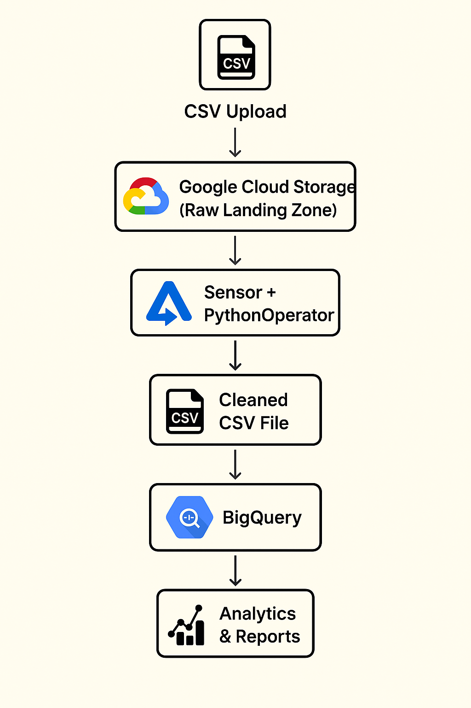
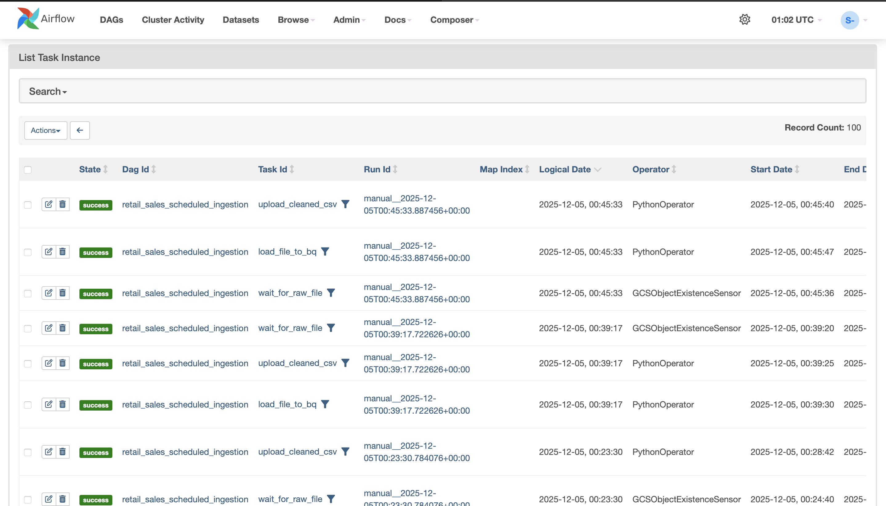
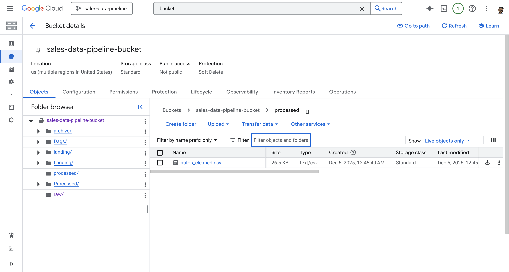
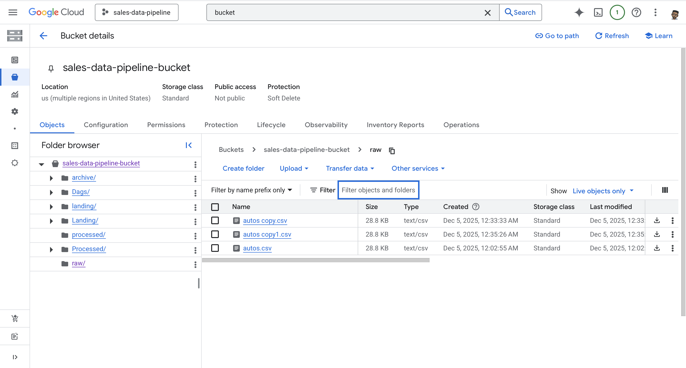
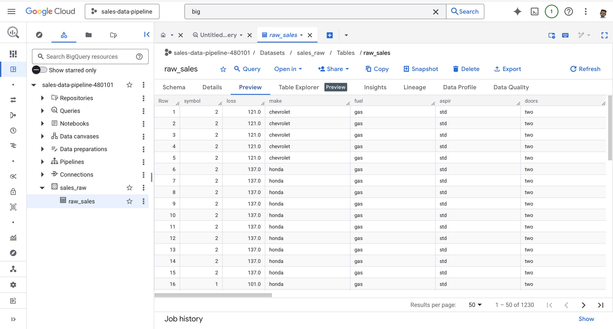
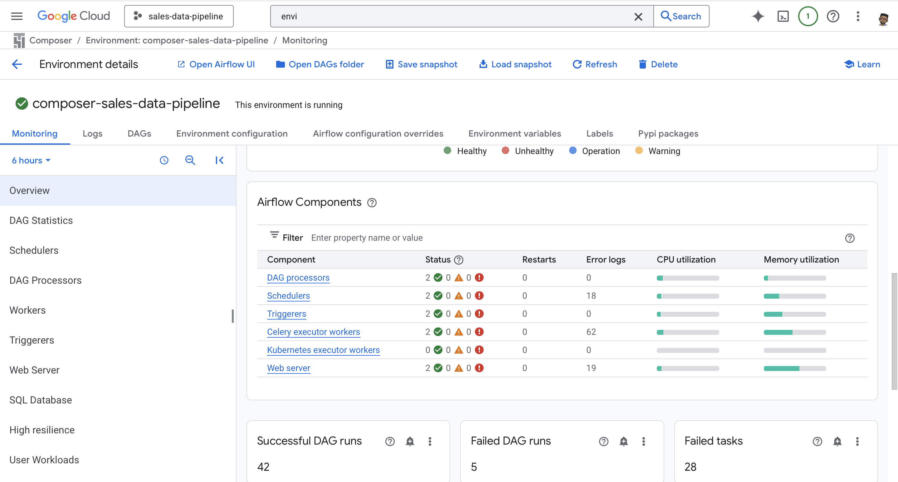
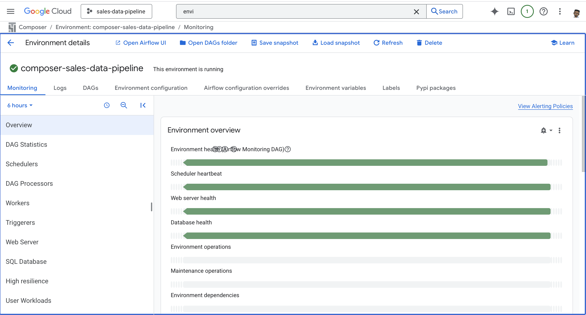

# Retail Sales ETL Pipeline with Apache Airflow, GCS & BigQuery  
*A Production-Grade Cloud Data Engineering Pipeline for Automotive Sales Data*

This project implements a **fully automated, production-grade ETL pipeline** designed to ingest and process daily automotive sales data. It extracts structured CSV files, stores raw artifacts in **Google Cloud Storage (GCS)**, applies column sanitization and schema normalization, and loads cleaned datasets into **BigQuery** for downstream analytics and reporting.

The pipeline is orchestrated using **Cloud Composer (Managed Apache Airflow)** and supports both **scheduled ingestion** and **event-driven execution** triggered by new file uploads.

---

## Architecture

         ┌─────────────────────┐
         │     CSV Upload      │
         │   (raw/autos.csv)   │
         └─────────┬───────────┘
                   │
                   ▼
         ┌─────────────────────┐
         │ Google Cloud Storage│
         │ (Raw Landing Zone)  │
         └─────────┬───────────┘
                   │  Sensor + PythonOperator
                   ▼
         ┌─────────────────────┐
         │  Cleaned CSV File    │
         │ processed/autos_cleaned.csv │
         └─────────┬───────────┘
                   │
                   ▼
         ┌─────────────────────┐
         │ BigQuery Raw Table  │
         │ sales_raw.raw_sales │
         └─────────────────────┘
                   │
                   ▼
         ┌─────────────────────┐
         │ Analytics & Reports │
         │ (Looker Studio / BI)│
         └─────────────────────┘

---

## Key Features

### Automated CSV Ingestion  
- Monitors GCS `raw/` bucket using **GCSObjectExistenceSensor**.  
- Supports both **daily batch ingestion** and **event-driven triggers** for real-time responsiveness.

### Cloud-Orchestrated ETL with Airflow  
- Managed via **Cloud Composer** with modular DAG design.  
- Handles retries, logging, and task orchestration across the full ETL lifecycle.  
- Task flow: `download → clean → append → upload → BigQuery load`.

### Data Cleaning & Processing  
- Column names are normalized for **BigQuery compatibility**:  
  - Removes special characters  
  - Converts to lowercase  
  - Replaces spaces and symbols with underscores  
- New rows are appended to the **existing cleaned CSV** in `processed/`, maintaining historical continuity.

### BigQuery Integration  
- Cleaned CSV is loaded into BigQuery in **append mode**.  
- Schema is **autodetected** to accommodate evolving file structures.  
- Enables analytics-ready queries and dashboarding via Looker Studio or other BI tools.

---

## Tech Stack

| Layer | Technology | Purpose |
|-------|------------|---------|
| **Orchestration** | Apache Airflow (Cloud Composer) | Workflow scheduling and DAG orchestration |
| **Data Lake** | Google Cloud Storage | Durable storage for raw and cleaned CSVs |
| **Warehouse** | Google BigQuery | Scalable analytics engine |
| **Language** | Python | ETL logic (Pandas, GCS Client, BigQuery Client) |
| **Libraries** | Pandas, io, Google Cloud SDK | Data transformation and GCP integration |

---

## Output Tables (BigQuery)

### **sales_raw.raw_sales**  
Stores cleaned, structured sales data with daily appends.

| Column | Description |
|--------|-------------|
| column_name | Sanitized column from raw CSV |
| ... | Other sales-specific metrics (autodetected) |

> Schema is autodetected from the cleaned CSV. New data is appended incrementally to preserve historical records.

---

## Project Screenshots

### **1. Airflow DAG**

### **2. GCS Bucket**

### **3. BigQuery**

### **4. GCP Airflow Environment**

---

##  Workflow Summary

1. **Sensor Task** monitors for new CSV in `raw/autos.csv`.  
2. **PythonOperator** cleans column names and appends rows to `processed/autos_cleaned.csv`.  
3. **PythonOperator** loads cleaned CSV into BigQuery in append mode.  
4. Data becomes available for **analytics dashboards** and further transformations.

---

This pipeline delivers a **robust, extensible ETL framework** for automotive sales data, with clean schema practices, scalable ingestion, and analytics-ready integration.
